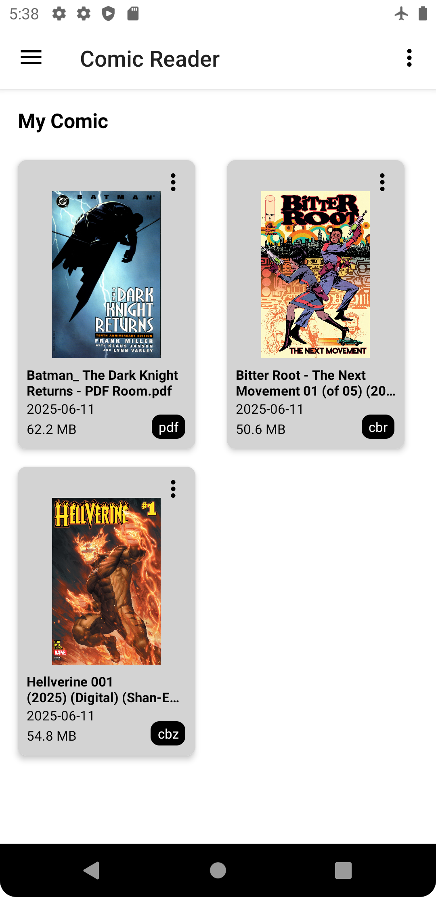

# 📚 Comic Reader (Java Version)

An Android comic reader app built with **Java**, supporting **CBR**, **CBZ**, and **PDF** formats.  
This is the **original version** of the Comic Reader project — later rewritten in Kotlin for modernization.

---

## 🚀 Features
- 📖 Read comics in **CBR**, **CBZ**, and **PDF** formats  
- 🗂️ Browse comics from folders  
- 🖼️ Thumbnail previews for quick browsing  
- ⏱️ Continue reading from last page  
- 🌓 Dark mode support  
- 🔄 Sort and filter comics  
- 🗑️ Clear recent history  

---

## 🧠 Built With
| Component | Technology |
|------------|-------------|
| Language | **Java** |
| Architecture | **MVVM (ViewModel + LiveData)** |
| UI | XML layouts |
| Database | Room (SQLite) |
| Image Loading | BitmapFactory |
| Min SDK | 26 |
| Target SDK | 35 |

---

## 📸 Screenshots
| Comics | Reader | Info Dialog |
|----------|---------|-------------|
|  |  |  |

---

## 🧩 Project Structure
